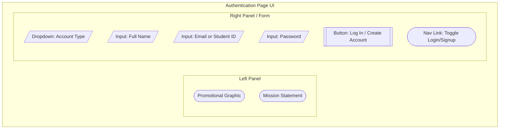
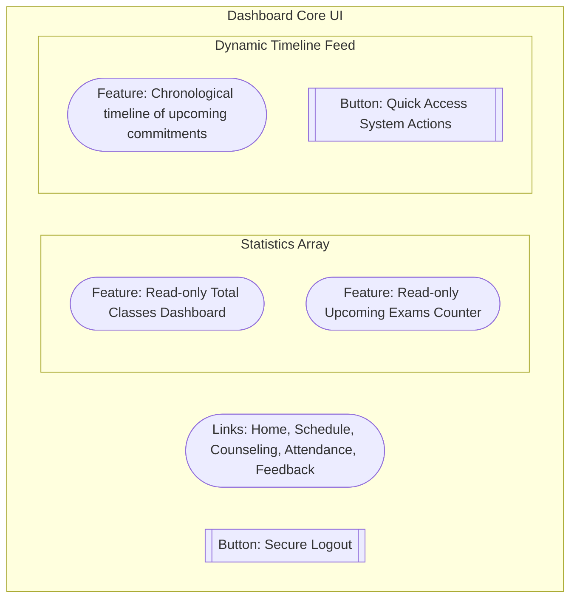
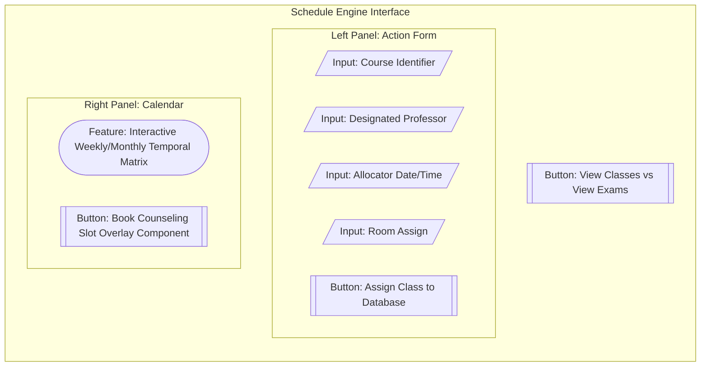
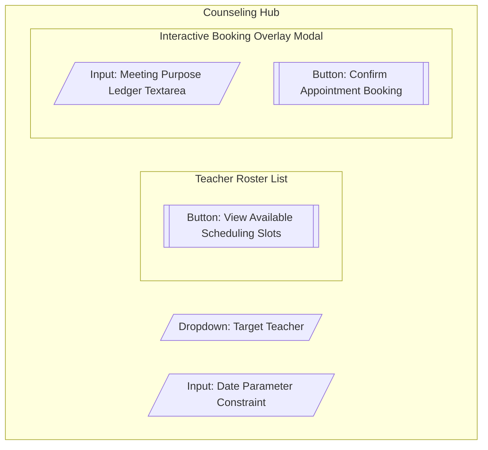
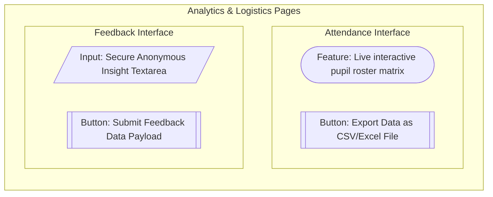

  
# EduPortal
## Department Management Web Application
---
## Web Project Lab Assessment

  

**Submitted To:**
Aminul Sir
Instructor, Web Project Lab

 

**Submitted By:**
Name: [Write Your Name Here]
Student ID: [Write Your ID Here]
Submission Date: Next Wednesday

   

### Index Directory:
**Page 1:** Index / Front Cover Page
**Page 2:** Project Documentation & Global Layout Mapping
**Page 3:** Sub-Module Feature Diagrams & Specifications
**Page 4:** Instructor’s Feedback Space
**Page 5:** Instructor’s Feedback Space

# 1. Project Description
**EduPortal** is a comprehensive, full-stack centralized hub designed to modernize university department operations. It bridges the gap between students, educators, and administrators by combining role-based dashboards, interactive automated scheduling, centralized attendance tracking, and direct counseling bookings into a single accessible interface. Its core purpose is to eradicate manual ledger management and fragmented internal communication channels, replacing them with a streamlined, database-driven educational lifecycle.

## 1.1 Technology Stack
| Domain | Technology | Purpose |
| :--- | :--- | :--- |
| **Frontend** | React, Next.js, HTML, CSS | Polished UI, routing, and State Management |
| **Styling** | Tailwind CSS | Responsive, utility-first UI design |
| **Backend Framework** | Next.js API routes, TS | High-performance serverless Node.js endpoints |
| **Database ORM** | Prisma | Advanced type-safe database queries & schemas |
| **UI Components** | Lucide React | Efficient, scalable interface vector graphics |
| **Database & Auth** | PostgreSQL/SQL, bcrypt | Secured user data handling and encryption |

# 2. Web Page Block Diagrams & Feature Mapping

## 2.1 Unified Authentication Interface (Login & Signup)

## 2.2 Core Role-Based Dashboard

## 2.3 Schedule Management Interface

## 2.4 Counseling & Logistics Portal

## 2.5 Attendance & Feedback Tracker

  <h1>Instructor Feedback Space</h1>
  
intentionally left blank

<!-- Left intentionally blank to enforce exactly 5 printed pages constraints -->

  <h1>Instructor Feedback Space</h1>
  
intentionally left blank

<!-- Left intentionally blank to enforce exactly 5 printed pages constraints -->
